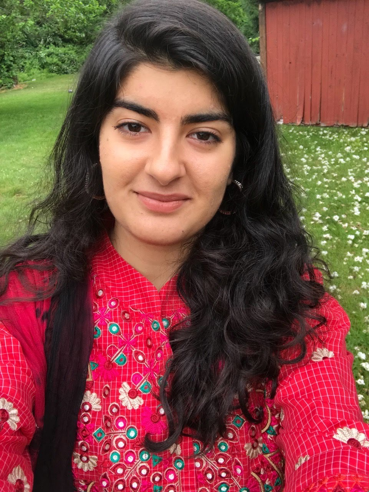

```{r setup, include=FALSE}
knitr::opts_chunk$set(echo = TRUE)
```


Hello Dr. Blanchard! I learned a lot by taking your class, I didn't have any prior coding experience and you made the process easily understandable. Thank you for always being available to help (and oftentimes staying longer than you had to). I hope you have a safe and enjoyable break :) 




## Labs


- Lab 1:  [Introduction to R and Reproducible Research](lab1_Gulalai.html)

- Lab 2:  [git, GitHub and Rstudio projectsFile](lab2.html)

- Lab 3A:  [Starting with the Data](Lab3A.html)

- Lab 3B:  [Manipulating Data](Lab3B.html)

- Lab 4:  [Data wrangling and graphing COVID-19 reporting data (Part 1)](Lab4.html)

- Lab 4A:  [Data Wrangling and Graphing COVID-19 Reporting Data, Part 2](Lab4A.html)

- Lab 5:  [Data wrangling and graphing COVID-19 reporting data (Part 2)](Lab5.html)

- Lab 5x:  [Interactive Graphs and Animations](Lab5x.html)

- Lab 6:  [Mapping COVID-19 reporting data](Lab6.html)

- Lab 7:  [Working on the command line](Lab-7.html)

- Lab 8:  [Sequence Alignment, Phylogenetic Analysis and Tree Visualization](Lab-8.html)

- Lab 9:  [Programming in R - Regular Expressions](Lab-9.html)

- Lab 9x:  [Programming in R - Control Structures and Functions](Lab-9x.html)

- Lab 10:  [Population genomics based on high throughput sequencing (HTS)](Lab-10.html)

- Lab 11: [Microbiome Analysis using dada2 and phyloseq](Lab11.html)

- Lab 12: [Network Analysis using Cytoscape and RCy3](Lab12.html)

- Lab 13: [Sprucing up your Rmarkdown and GitHub Page](Lab13.html)


